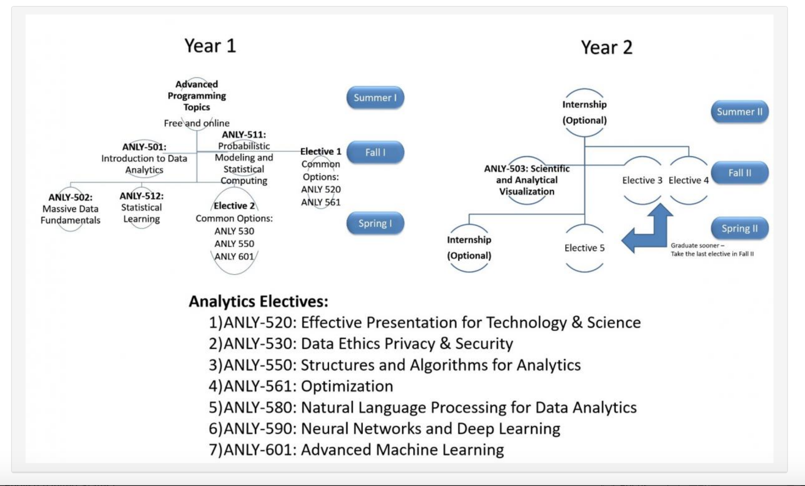

# GeorgeTown University

**M**[**aster of Science in Analytics-Data Science**](https://analytics.georgetown.edu/about)\*\*\*\*

Students in the M.S. in Analytics program build a solid knowledge in data analytics fundamentals and then add skills in visualization, big data computing, and machine learning. Important soft skills such as communication, teamwork, and problem solving techniques are part of the training throughout. Students who complete the program pursue careers in fields including business intelligence, precision medicine, policy analytics, finance, marketing, online banking, big data infrastructure, and education. The data science graduate program also serves as preparation for students who wish to enter a Ph.D. program in Applied Mathematics, Statistics, or Computer Science, or Economics.

Our five-course core \(plus zero-credit summer course\) is designed to give students an overview of the massive data landscape.

* [Advanced Programming Topics](https://analytics.georgetown.edu/academics/degree-requirements#ANLY-500) - _ONLINE_  \(no credit\) 
* [Introduction to Data Analytics  **\(ANLY-501\)**](https://analytics.georgetown.edu/academics/degree-requirements#ANLY-501) 
* [Massive Data Fundamentals  \(**ANLY-502**\)](https://analytics.georgetown.edu/academics/degree-requirements#ANLY-502) 
* [Scientific and Analytical Visualization  \(**ANLY-503**\) ](https://analytics.georgetown.edu/academics/degree-requirements#ANLY-503) 
* [Probabilistic Modeling and Statistical Computing  \(**ANLY-511**\)](https://analytics.georgetown.edu/academics/degree-requirements#ANLY-511) 
* [Statistical Learning for Analytics  \(**ANLY-512**\)](https://analytics.georgetown.edu/academics/degree-requirements#ANLY-512)

