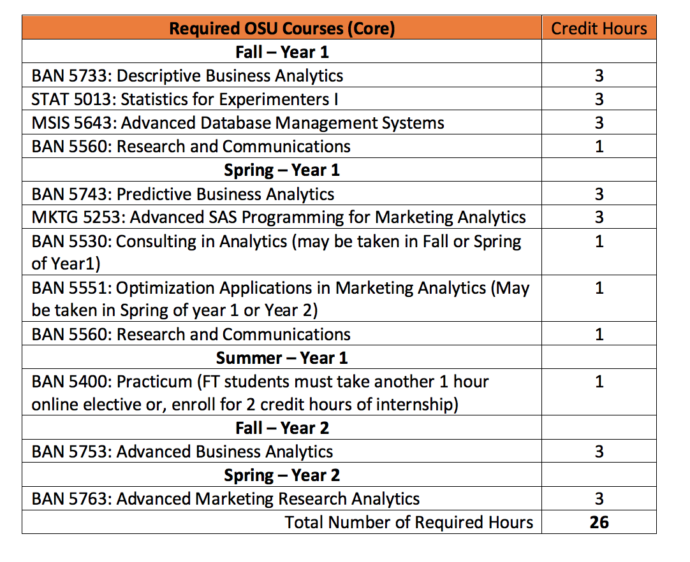
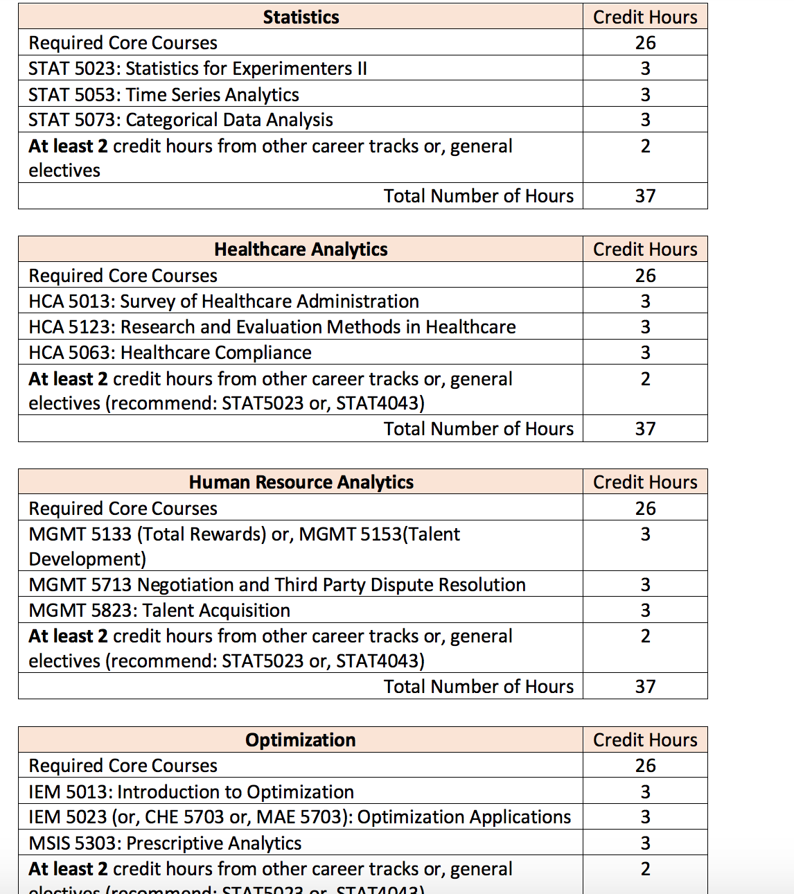
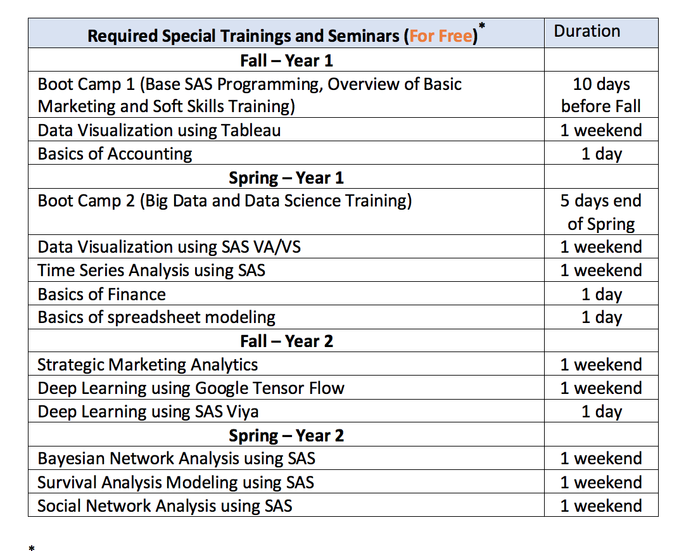

# Oklahoma State Universit

\*\*\*\*[**M.S. in Business Analytics \(MSBAN\)**](https://business.okstate.edu/analytics/msban/)\*\*\*\*

Merger of MS in MIS with Data Science option, MS in Business Analytics

The Spears School of Business developed and offered one of the first analytics programs in the nation, with two distinct tracks built on our strengths and diversity of talents. Over time, Spears Business has developed strong relationships with major analytics providers such as SAS, Teradata, IBM, and others.

As the needs of business have evolved, along with the integration of different commercial and open source software as a common toolset for analytics/data science professionals, OSU, in response, has now opted to create one common program \(pending internal approvals\). This program will include an integrated core set of data science experiences, while allowing the students to specialize in areas such as marketing analytics, health analytics, among others.

“This is an exciting development and represents OSU’s and the Spears School’s commitment to providing a world-class interdisciplinary, value-added analytics/data science program staffed by award winning instructors and internationally known experts in the field,” said Rick Wilson, head of the Department of Management Science and Information Systems.

“I am delighted to see this merger happen,” said Goutam Chakraborty, director of the Master’s in Business Analytics program. “This merger will allow us to provide a high-class, high-touch, comprehensive master’s program for graduate students in the Spears School of Business.”

The Master of Science in Business Analytics \(MSBAN\) is a comprehensive inter-disciplinary program in business data analytics conducted in a multi-platform environment that includes  **SAS®**, **Python**, **R**, **SQL**, **Tableau**, etc. Additionally, the program places a strong emphasis on soft skills and business acumen development.

“MSBAN curriculum is designed to produce the best in class **advanced analytics** and marketing **data science** professionals by focusing on holistic development of each candidate. In addition to classes, students are provided numerous free trainings beyond their coursework in many advanced analytics topics as well as soft skills. This is the place where students **work hard and play hard** to achieve their dreams,” according to Dr. Goutam Chakraborty, Director of MSBAN program.

M.S. in Business Analytics \(MSBAN\) for Full Time \(On Campus\) Students From 2018 The Master of Science in Business Analytics \(MSBAN\) offers hands-on application of data analysis in a multi-platform environment that includes deep exposure to SAS® tools as well as training using other tools and programming languages such as Python, R, SQL, Tableau, etc. Additionally, the program places a strong emphasis on soft skills and business acumen development. The table below shows the approved core and elective OSU courses in for the full time MSBAN program. Full time MSBAN students must obtain at least 37 credit hours to graduate. Beyond these OSU courses, full time MSBAN students are required to attend several boot camps and special trainings for free \(listed at the bottom of the table\). Required OSU Courses\(Core\) Credit Hours Fall –

 Year 1 

BAN 5733: Descriptive Business Analytics 3 STAT 5013: Statistics for Experimenters I 3 MSIS 5643: Advanced Database Management Systems 3 BAN 5560: Research and Communications 1 Spring – Year 1 BAN 5743: Predictive Business Analytics 3 MKTG 5253: Advanced SAS Programming for Marketing Analytics 3 BAN 5530: Consulting in Analytics \(may be taken in Fall or Spring of Year1\) 1 BAN 5551: Optimization Applications in Marketing Analytics \(May be taken in Spring of year 1 or Year 2\) 1 BAN 5560: Research and Communications 1 Summer – Year 1 BAN 5400: Practicum \(FT students must take another 1 hour online elective or, enroll for 2 credit hours of internship\) 1 Fall – Year 2 BAN 5753: Advanced Business Analytics 3 Spring – Year 2 BAN 5763: Advanced Marketing Research Analytics 3 Total Number of Required Hours 26 Career Focused Elective Tracks: Marketing Analytics Credit Hours Required Core Courses 26 MKTG 5133: Marketing Management 3 ACCT 5183: MBA Financial Reporting 3 MKTG 5561: Customer Lifetime Value Models in Marketing \(Fall\) 1 BAN 5511: Web Analytics and Digital Marketing \(Summer\) 1 BAN 5521: GIS Applications in Marketing Analytics \(Summer\) 1 At least 2 credit hours from other career tracks or, general electives \(recommend: STAT5023 or, STAT4043 or, FIN5013\) 2 Total Number of Hours 37 Plan of Study as of Fall 2018 with Elective Tracks plus new course numbers Statistics Credit Hours Required Core Courses 26 STAT 5023: Statistics for Experimenters II 3 STAT 5053: Time Series Analytics 3 STAT 5073: Categorical Data Analysis 3 At least 2 credit hours from other career tracks or, general electives 2 Total Number of Hours 37 Healthcare Analytics Credit Hours Required Core Courses 26 HCA 5013: Survey of Healthcare Administration 3 HCA 5123: Research and Evaluation Methods in Healthcare 3 HCA 5063: Healthcare Compliance 3 At least 2 credit hours from other career tracks or, general electives \(recommend: STAT5023 or, STAT4043\) 2 Total Number of Hours 37 Human Resource Analytics Credit Hours Required Core Courses 26 MGMT 5133 \(Total Rewards\) or, MGMT 5153\(Talent Development\) 3 MGMT 5713 Negotiation and Third Party Dispute Resolution 3 MGMT 5823: Talent Acquisition 3 At least 2 credit hours from other career tracks or, general electives \(recommend: STAT5023 or, STAT4043\) 2 Total Number of Hours 37 Optimization Credit Hours Required Core Courses 26 IEM 5013: Introduction to Optimization 3 IEM 5023 \(or, CHE 5703 or, MAE 5703\): Optimization Applications 3 MSIS 5303: Prescriptive Analytics 3 At least 2 credit hours from other career tracks or, general electives \(recommend: STAT5023 or, STAT4043\) 2 Total Number of Hours 37 Other Approved General Electives Credit Hours MKTG 5243: Base SAS programming for Database Marketing 3 FIN 5013: Business Finance 3 EEE 5863: CIE Scholar Practicum 3 ECON 5113: Managerial Economics 3 MSIS 5223 : Analytics programming \(R and Python\) MSIS 5673: Descriptive Analytics and Visualization 3 STAT 4043 :Applied Regression \(must enroll for graduate credit\) 3 Plan of Study as of Fall 2018 with Elective Tracks plus new course numbers Required Special Trainings and Seminars \(For Free\)

* Duration

  Fall – Year 1

  Boot Camp 1 \(Base SAS Programming, Overview of Basic

  Marketing and Soft Skills Training\)

  10 days

  before Fall

  Data Visualization using Tableau 1 weekend

  Basics of Accounting 1 day

  Spring – Year 1

  Boot Camp 2 \(Big Data and Data Science Training\) 5 days end

  of Spring

  Data Visualization using SAS VA/VS 1 weekend

  Time Series Analysis using SAS 1 weekend

  Basics of Finance 1 day

  Basics of spreadsheet modeling 1 day

  Fall – Year 2

  Strategic Marketing Analytics 1 weekend

  Deep Learning using Google Tensor Flow 1 weekend

  Deep Learning using SAS Viya 1 day

  Spring – Year 2

  Bayesian Network Analysis using SAS 1 weekend

  Survival Analysis Modeling using SAS 1 weekend

  Social Network Analysis using SAS 1 weekend

  \*

  : Some of the free seminars and trainings may change based on shifting demand in the

  marketplace and availability of trainers. Full time \(on campus\) MSBAN students are also

  required to work on an independent research project in their 2nd semester and participate in

  Toastmasters in their 3rd semester. In addition, Full time \(on campus\) MSBAN students are

  required to participate in group project and/or analytics competitions in each of their four 

