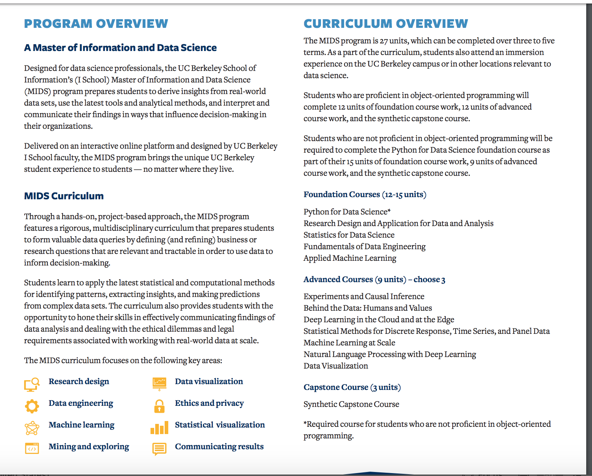

# Berkeley



## Academics Overview

The [Online Master of Information and Data Science \(MIDS\)](https://datascience.berkeley.edu/) is designed to educate data science leaders. The professional degree program prepares students to derive insights from real-world data sets, use the latest tools and analytical methods, and interpret and communicate their findings in ways that change minds and behaviors. The program features a multidisciplinary curriculum that draws on insights from the social sciences, computer science, statistics, management, and law.

### Curriculum Highlights

The curriculum prepares students to ask good questions of data by defining \(and refining\) business or research questions that are relevant and tractable in order to use data to inform decision making. You will learn best practices for data collection and engineering — and how these factors affect timeliness, accuracy, and reliability of large-scale storage models.

Students learn to apply the latest statistical and computational methods for identifying patterns, extracting insights, and making predictions from complex data sets. You will be given the opportunity to hone your skills in effectively communicating findings of data analysis and dealing with the ethical dilemmas and legal requirements associated with working with real-world data at scale.

The [program’s courses](https://datascience.berkeley.edu/academics/curriculum/) are divided into foundation courses, advanced courses, and a synthetic capstone.

#### Capstone

MIDS students will complete a capstone by executing a culminating project that integrates the core skills and concepts learned throughout the program. The capstone combines the technical, analytical, interpretive, and social dimensions required to design and execute a full data science project. Students will learn integral skills that prepare them for long-term professional success in the field.

The program is fully accredited by the [Western Association of Schools and Colleges \(WASC\) External link ](http://www.acswasc.org/).

### Acquired Skills

The MIDS core curriculum focuses on the following key skills:

* Research Design
* Data Engineering
* Machine Learning
* Mining and Exploring
* Data Visualization
* Ethics and Privacy
* Statistical Analysis
* Communicating Results

Like all programs offered by the I School, MIDS features a project-based approach to learning and encourages the pragmatic application of a variety of tools and methods to solve complex problems. MIDS students may receive access to Amazon Web Services and IBM’s big data platform to complete specific coursework.

### Program Paths

The MIDS program consists of 27 units and can be completed on one of three paths: full time, accelerated, or part time. Students who wish to take the program on an accelerated or part-time basis must receive approval from UC Berkeley.

**The full-time path is designed for working professionals** and can be completed in 20 months, with two courses per semester.

**The accelerated path** gives students the opportunity to take three courses per semester to complete the program in as few as 12 months.

**The part-time path** allows students to drop down to one course per semester after the first term and complete the program in no more than 32 months.

[Click here to download a program brochure. External link ](https://cdn3.datascience.berkeley.edu/content/815bd3e758214755836de7a48e0b3e55/UCB-MIDS_Brochure.pdf)

### Immersion

While all courses are delivered online, students are required to attend at least one, 3–4 day [immersion on the UC Berkeley campus](https://datascience.berkeley.edu/academics/immersion/) or in other locations relevant to data science. During the immersion, Master of Information and Data Science \(MIDS\) students benefit from meeting classmates and professors in person, participating in workshops, and networking with other data science professionals. Immersions are crafted to deliver additional learning, networking, and community-building opportunities to MIDS students.

REQUEST INFORMATION

