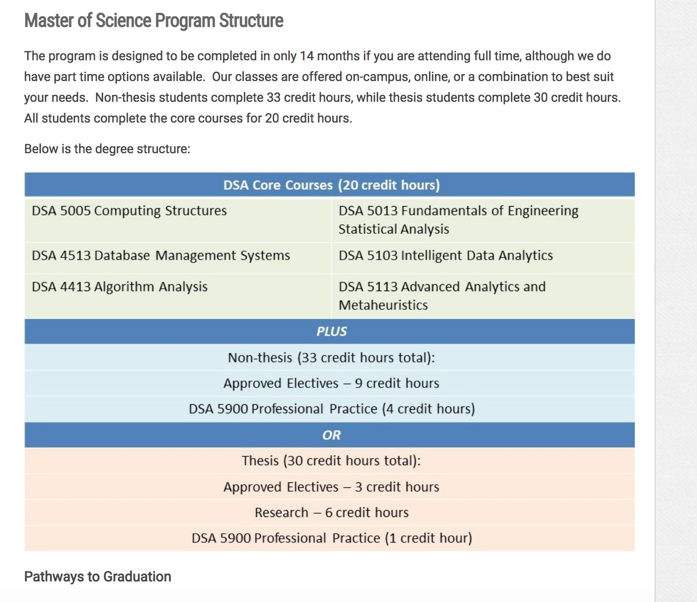

# University of Oklahoma

\*\*\*\*[**M.S. Data Science and Analytics**](http://www.ou.edu/coe/dsa)\*\*\*\*

## Data Science and Analytics

#### OFFERED ON CAMPUS, ONLINE OR AS A COMBINATION

Big Data – two small words that can have a major impact on how companies make key decisions.

Organizations large and small employ data scientists to determine profitable lines of business, characterize customers, evaluate and predict risks, improve operational efficiencies, predict system performance and perform complex simulations.

Data Science and Analytics is the development of analytical models and methods to extract new knowledge from vast, complex data.

The University of Oklahoma is proud to offer a Graduate Certificate in Data Science and Analytics, and a Master of Science in Data Science and Analytics.  Current OU students can complete a dual degree or add our certificate.

Course offerings come from a collaboration between the Schools of Computer Science and Industrial and Systems Engineering.  Graduates will have the skills to design and build tools to extract, assimilate and analyze data, and the systems understanding to predict and enhance future performance for enterprises across all domains of the private and public sectors.

### Core Syllabi

Here are example syllabi for the required core courses: [DSA 5013 Fundamentals of Engineering Statistical Analysis \(pdf\)](http://www.ou.edu/content/dam/CoE/dsa/docs/DSA-5013.pdf)  
 [DSA 5103 Intelligent Data Analytics \(pdf\)](http://www.ou.edu/content/dam/CoE/dsa/docs/DSA-5103.pdf)  
 [DSA 5113 Advanced Analytics & Metaheuristics \(pdf\)](http://www.ou.edu/content/dam/CoE/dsa/docs/DSA-5113.pdf)  
 [DSA 5005 Computing Structures \(pdf\)](http://www.ou.edu/content/dam/CoE/dsa/docs/DSA-5005.pdf)  
 [DSA 4413 Algorithm Analysis \(pdf\)](http://www.ou.edu/content/dam/CoE/dsa/docs/DSA-4413.pdf)  
 [DSA 4513 Database Management Systems \(pdf\)](http://www.ou.edu/content/dam/CoE/dsa/docs/DSA-4513.pdf)  
 [DSA 5900 Professional Practice \(pdf\)](http://www.ou.edu/content/dam/CoE/dsa/docs/DSA%205900%20Professional%20Practice.pdf)  

### Elective Syllabi

Here are some examples of elective syllabi offered: [DSA 5001 Data Analytics and Media \(pdf\)](http://www.ou.edu/content/dam/CoE/dsa/docs/DSA-5001.pdf)  
 [DSA 5011 Introduction to R \(pdf\)](http://www.ou.edu/content/dam/CoE/dsa/docs/DSA-5011.pdf)  
 [DSA 5021 Data Analytics and Meteorology \(pdf\)](http://www.ou.edu/content/dam/CoE/dsa/docs/DSA-5021.pdf)  
 [DSA 5203 Time Series Analysis \(pdf\)](http://www.ou.edu/content/dam/CoE/dsa/docs/DSA-5203.pdf)  
 [DSA 5303 Financial Engineering Analytics \(pdf\)](http://www.ou.edu/content/dam/CoE/dsa/docs/DSA-5303.pdf)  
 [DSA 5403 Bayesian Statistics \(pdf\)](http://www.ou.edu/content/dam/CoE/dsa/docs/DSA-5403.pdf)  
 [CS 5293 Text Analytics \(pdf\)](http://www.ou.edu/content/dam/CoE/dsa/docs/CS%205293%20Text%20Analytics.pdf)  
 [CS 5593 Data Mining \(pdf\)](http://www.ou.edu/content/dam/CoE/dsa/docs/CS-5593.pdf)  

### About Fundamentals of Engineering Statistical Analysis

