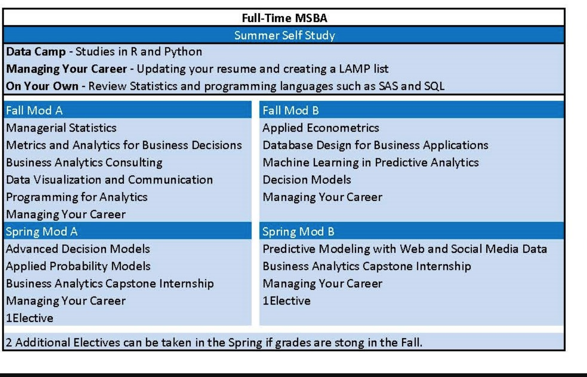

# Southern Methodist Univeristy - BA

## [Master Of Science In Business Analytics](https://www.smu.edu/cox/degrees-and-programs/ms-in-business-analytics)

## 

In the past, companies have focused on reporting, data management and business intelligence. **Business Analytics** goes beyond the traditional data, BI and reporting environments and focuses on how to better analyze your business using information to gain insight to the business. It extends data management and business intelligence \(data warehousing\) to enable the management of big data, and combines it with data analytics and business information to analyze consumer behavior, web site data, marketing data and even to perform predictive analytics. The broad and intensive curriculum across a range of management disciplines and functions explores the latest methods of translating data into relevant information for decision-makers.

With big data, firms can react in real-time to customize product and service offerings, if they have the **highly specialized talent** trained to leverage this increased complexity. **SMU Cox** recognized this high-growth and high-reward career path when we developed the MSBA program for those interested in solving today’s business challenges using big data. In fact, **85% of the positions in the field of business analytics require an advanced degree**, with 75 percent listing an MS degree as an educational requirement for a career in the field. Graduates of the Cox MSBA program will be well poised to take advantage of these increasing opportunities.

The **Master of Science in Business Analytics \(MSBA\)** degree at SMU Cox provides students with the expertise and specialized Analytic skills that employers in IT, marketing, operations and consulting are demanding now. The broad and intensive curriculum across a range of management disciplines and functions explores the latest methods of translating data into relevant information for decision-makers. Either **Full-Time** or **Part-Time**, the MSBA program prepares students for successful careers in the burgeoning field of business analytics from business analysts, data analysts, marketing analysts, financial analysts, data base and data warehouse architects to data scientists.

* 

**program specialization**, or tracks

* Business Process Analytics- DB Concepts & Applications
* Customer Analytics - Marketing Research & Customer Centric Analytics

* **Required Orientations and Boot Camps**

  Classes typically begin mid-August but it is highly recommended that students arrive in Dallas the beginning of August. International students can arrive up to 1 month before the start date of classes. Prior to the start of classes, students will be required to attend the following:

  **MSBA Orientation - This is mandatory for ALL students!**  
  It is held the first week in August for 2 days. Specific dates will be sent in the summer.

  **International Orientation - This is mandatory for International Students**  
  International students are required to attend both the MSBA Orientation as well as the International Orientation. International Orientation is one day scheduled in the beginning of August. Specific dates will be sent in the summer.

  **Boot Camps – These are mandatory for ALL students!**  
  There are 2 bootcamps that will be held in August that are required for all Students.

  * Introduction to Analysis with Bryan Smith 2 Sessions for 1 day each from 9-4 - pick 1 session to attend.
  * Excel / VBA Bootcamp with Stewart Rogers 2 Sessions - each 1/2 a day - students choose a session, morning or evening.

  **Required Courses**

  **Advanced Decision Models** \(2 credits\) The course extends topics covered in Decision Models \(ITOM 6252\). Additional modeling techniques covered include multiple objective, nonlinear and non-smooth constrained optimization. Attention will be paid to how various types of models are formulated and solved using Simplex, GRG and Evolutionary solvers available in Excel. The use of visual basic macros to implement user-friendly decision support systems for model implementation will be addressed. Additional modeling techniques topic such as Analytical Hierarchy Process and Dynamic programming will be covered. Finally, creating and solving decision models in other platforms, such as R and CPLEX will be covered. Prerequisite: ITOM 6252 Decision Models

  **Applied Econometrics** \(2 credits\) This course develops both a conceptual and practical understanding of the modeling process. Students will build upon their knowledge of regression and extend to more advanced methods such as logistic regression and generalized linear models. In addition, this course devotes significant attention to interpreting and using models to make decisions, along with reviewing common complexities of data analysis such as endogeneity. By the end of the course, students will be able to complete a rigorous analysis from start to finish, consisting of initial problem identification, data analysis and model specification, and finally making an informed decision based on the results. All data analysis and visualizations will be done in R.

  **Applied Probability Models** \(2 credits\) This course applies fundamental concepts of probability to data analysis and forecasting. The methodological focus is on both maximum likelihood and Bayesian approaches to statistical inference. Particular attention is placed on count, choice and timing models, with heterogeneous latent variables. Applications will be drawn from a wide range of business settings, such as new product forecasting, modeling customer retention and lifetime value, and market segmentation.

  **Business Analytics Capstone Internship** \(4 credits\) The Business Analytics Capstone Internship integrates the students’ specific knowledge of business analytics learned during the MSBA program with the key skills of critical thinking, independent research, interdisciplinary learning, and civic engagement. Students are required to either 1\) engage in a part time \(no more than 20 hours per week\) internship with a company in a role in the analytics field during the Spring semester or 2\) engage in a semester-long project with local companies in the analytics field. This is a required semester-long course for all full-time students to understand the complexities of a complete analytics project and the major components of the system development life cycle \(SDLC\). A solid understanding of the business is the foundation upon which successful analytics projects are built. This project will allow students to apply the academic concepts, including the analysis of the business needs which have been discussed in the classroom. Students will receive 4 credit hours for this course. Students will be required to complete a set of deliverables as part of the project to be graded, regardless of whether they take on an internship or engage in the semester-long project.

  **Business Analytics Consulting** \(2 credits\) Understanding and documenting the business processes and decisions that business analytics are expected to support is central to developing solutions that improve organizational performance. In this class, students will learn the conceptual frameworks, tools and skills needed to develop a blueprint for analytics. This entails successfully analyzing the high-level requirements for business analytics, prioritizing and outlining solutions, proposing business process improvements to generate the requisite data, and making the business case.

  **Machine Learning in Predictive Analytics** \(2 credits\) This course examines a variety of data mining methods such as machine learning/decision trees, neural networks, clustering, unstructured data analysis \(a.k.a. text mining\) and association rules. The course also gives an introduction to the unique set of criteria that managers need to understand in order to choose the right technique to apply to common business challenges involving large quantities of data. Applied statistics and experimental design are foundational pillars of the discipline.

  **Data Visualization and Communication** \(2 Credits\) In this course, students will be taught how to effectively communicate the results of the business analytics that they perform, in both written and oral presentations. Students will learn the concepts of data blending and data extraction using Alteryx and the development of charts, graphs, geospatial analytics and dashboards using Tableau. With experiential learning, MSBA students will work companies to build queries and dashboards and communicate business insights using real data.

  **Database Design for Business Applications** \(2 credits\) The objective of this course is to make students familiar with the design and application of modern database applications. Students start with the theoretical foundations of database design \(ERD, normalization\) and then move on to hands-on knowledge of actually managing/administering a MySQL database, one of the most popular open-source databases in the world. After taking this course, students will be able to setup and access MySQL database with SQL, R and Python; create conceptual \(Entity Relationship Diagram - ERD\) and logical database design; and create interactive Shiny applications that connect with database. Homework assignments and an implementation project in MySQL/R Shiny will reinforce both the design issues and the practical skills covered in the course.

  **Decision Models** \(2 credits\) The purpose of this course is to help students understand how complex business problems can be represented mathematically and analyzed. Models will be created and solved using tools available for Excel. Attention will be paid to how decision models should be created and maintained in spreadsheets to reduce the probability of formulation errors and increase managerial value. Constrained optimization techniques such as linear, integer and binary math programming models will address maximization or minimization of objectives when faced with limited resources or other constraining factors. Decision analysis techniques such as decision trees, payoff and opportunity cost tables and Bayesian revision will address modeling tools for decision making when faced with significant uncertainties. Monte Carlo simulation techniques allow for the description of possible performance outcomes when faced with random model input parameters.

  **Managerial Statistics** \(2 credits\) This course provides an overview of statistical methodologies and applications, It includes probability applications, hypothesis testing, simple and multiple regression analysis, sampling, quality control, and forecasting. The course is taught using class lectures, cases, and Excel programs and spreadsheets.

  **Managing Your Career** \(1 credit\) This course empowers MSBA students with the knowledge and tools to effectively manage their own careers. Topics include, but not limited to: exploring career opportunities within the Business Analytics space, building and leveraging a professional network and developing a personal marketing plan. Each week a different company will come to the class to discuss analytics in their company. This course takes place in every Module over the time frame of the program. This is an optional class for Part-Time Students.

  **Metrics and Analytics for Business Decisions** \(2 credits\) To make sound business decisions, managers need insights about their customers, their own company, and that of their competitors. Such insights are obtained through appropriate analysis of data. These analyses are based on metrics related to business decisions. In this course, students will be exposed to various metrics used in marketing, financial, and other business decisions. They will then learn how to compute those metrics through analysis of real data and leverage the insights gained from those metrics in effective business decision making. In the process, they will gain experience in manipulation of real-world data, use of simple regression and other data analysis techniques using the metrics, as well as how to apply them in marketing and other business situations.

  **Predictive Modeling with Web and Social Media Data** \(2 credits\) This course focuses on methods to analyze user generated content on the web and social media \(e.g., clickstreams on an e-commerce portal, forum discussions, reviews in online marketplaces and, likes, comments and shares on social networks, etc.\). We use tools such as Google Analytics, R, Python, Tensor Flow and NodeXL to analyze such data and gain insights into design, pricing, marketing and delivery of products in the new economy.

  **Programming for Analytics** \(2 credits\) This course is an introduction to practical analysis with emphasis on the use of programs and computer packages. Topics include structured programming with R and Python.

* **Electives**

  At Cox, you can customize your degree to suit your goals. At least four of your courses in the MSBA program are electives. With choices ranging from big data to retailing analytics, consumer behavior to database marketing, you’ll craft a track that ladders up to the career you want: business analytics, process optimization, decision modeling, data science, marketing strategy — wherever your knack for problem-solving takes you.

  **Sample Electives**

  In addition to the required courses, students will take 4 electives during the program. If students perform well in the first semester, it is also possible to take 2 additional electives \(a total of 6\) during the program. The following is a list of possible electives in the program.

  **Advanced Product Brand Management** \(2 credits\) Focuses on strategic issues and decisions germane to the management of consumer products and brands. Includes product market structure, category management, product life cycle and product line strategy, brand equity, brand growth strategies, and financial valuation of brands. Integrates lecture, discussion, and case analysis, with a focus on student case presentations.

  **Big Data Platforms** \(2 credits\) This course focuses on the development of foundational Big Data technical skills leveraging Spark and Python.  Students learn through in-class labs and weekly programming assignments.  The objective of this course is to prepare you to serve as a functioning technical member of a Big Data team.

  **Business Intelligence** \(2 credits\) In this class, you will learn about the Business Intelligence technologies that you can expect to employ as a Business Analyst, especially deep SQL skills. Learning will take place through lecture and considerable hands-on engagement with these tools. Topics include Data Warehouse, ETL, Advanced SQL, and etc.

  **Consumer Behavior** \(2 credits\) This course is the study of why people buy what they buy. It includes an in-depth examination of the consumer decision-making processes and the factors that influence those processes. We closely look at how people make product-related decisions and the information used to make those decisions. The course is taught from a consumer-psychology perspective and shows how that perspective can be applied to business.

  **Customer Insights and Market Intelligence** \(2 credits\) This course demonstrates how firms can use primary and secondary data to gain insights about the product market and its customers and competitors. Such insights form the basis of making sound marketing decisions related to product, price, place and promotions. Emphasis is laced on quantitative and qualitative analytical approaches to inferring insights. Topics include marketing metrics; market dynamics analysis; and gaining insights from attitudinal, behavioral, and online data.

  **Data-Driven Marketing** \(2 credits\) In this course, students will be taught a variety of models that are commonly used in marketing analysis. Students will learn how to target customers using logistic regression, segment customers with cluster analysis, and develop perceptual maps using factor analysis. In addition to learning traditional marketing analysis techniques, this course reviews collaborative filtering, linear discriminant analysis, topic modeling, and principal components analysis, among others. The emphasis on this course is on using sophisticated methods to make better marketing decisions. All data analysis and visualizations will be done in R.

  **Forecasting and Predictive Analytics** \(2 credits\) This course provides an introduction to a variety of common statistical techniques for predictive analytics and forecasting. The key topics that we will cover include qualitative techniques, smoothing and decomposition of time series, regressions, the Box-Jenkins Methodology. We will emphasize on hands-on applications using a statistical package JMP, rather than technical foundations and derivations. We will also critically study these techniques, examining both their usefulness and limitations. Through this course you will learn to model uncertain business outcome, so that you can more effectively manage such uncertainty.

  **Managerial Decision Making** \(2 credits\) The purpose of this course is to help you become a better decision maker. More than anything else, what managers, analysts, and consultants do is make decisions. We will discover a series of mistakes that typical businesspeople, including you, make in a variety of managerial decision contexts, including hiring decisions, investment decisions, purchase decisions, and strategic decisions. We will do so using insights from behavioral sciences \(such as psychology, behavioral economics, consumer and organizational behavior\). At the same time, we will explore how to correct these mistakes and how to reach optimal solutions. Instead of relying on mathematic models or academic theories, the class is organized in a “workshop” format with a combination of case studies, discussions, student presentations, and exercises illustrating and applying the main concepts. This class will teach you the most important “soft skills” that will help you to become, and stay, a successful businessperson.

  **Managing Big Data - Managerial** \(2 credits\) This course focuses on core concepts in the adoption of Big Data technologies by modern enterprises. We'll balance lecture and discussion with some in-class lab work which will give you a foundational understanding of these technologies.

  **Operations Analytics** \(2 credits\) Organizations invest the bulk of their human and financial resources in their operations functions. In this course, students will study analytical models and techniques that can be used to improve operational and firm performance. Decision making under uncertainty will be addressed using static stochastic optimization, two-stage optimization with recourse, dynamic programming and game theory. Optimization models will be used to tackle problems in inventory management, revenue management, supply chain management, forecasting and new product development. Students will also learn how strategic decisions can be aided by data-driven, analytical models. The goal is to understand the role that analytics and analytical models can play in improving an organization’s operational processes.

  **Project Management** \(2 credits\) Managing projects in a cost effective and timely manner is one of the most challenging tasks in any organization. Competent project leadership requires understanding of how to allocate financial, material and time-based resources, and the ability to motivate and maintain focus of the project team. This course provides relevant project management skills by examining project decisions at three levels; \(i\) structuring and managing the task and leading the project team in an individual project, \(ii\) aggregate linkages across a portfolio of projects and management of programs, \(iii\) project contracting, partnering and open innovation. It introduces tools and concepts that enable project managers to evaluate, manage and execute critical functions of any project while ensuring speed, efficiency and market impact.

  **Research for Marketing Decisions** \(2 credits\) Marketing research is the formal process of gathering information needed by managers to make decisions – decisions about marketing opportunities and problems, decisions to determine and evaluate the marketing mix, and decisions based on monitoring market performance. Decisions such as: Should a new product be introduced? What are the effects of a competitor’s action? What are the most effective channels of distribution? How do marketing actions affect brand awareness or sales revenue? In this course, you will gain a solid foundation in designing and executing effective marketing research through lectures, interactive discussions and a hands-on marketing research project with a sponsoring corporation. Through the project, you will design the research, collect customer data, and analyze the data using statistical methods relevant to your research problem. In a final group presentation to company leaders, you will draw customer insights from your analysis and propose strategic and tactical recommendations for profitable growth.

  **Retailing Analytics** \(2 credits\) The vast majority of consumer expenditures, which represent more than $5 trillion dollars and 68 percent of the United States gross domestic product, are made through retailers. Moreover, the average consumer product company spends as much on trade promotions \(such as promoting its products to retailers\) as it does on media advertising and consumer promotions combined. These facts highlight the importance of retailer behavior and trade promotions in consumer marketing. This course takes the retailer’s point of view, exploring strategic and tactical decision-making by assessing the impact of these decisions on both consumer shopping behavior and the retailer’s own operating costs. Students explore issues in sales promotion, pricing, product mix, and store location in order to gain an understanding of consumer response in these areas.

  **Revenue Management** \(2 credits\) The revenue management approach is to exploit differences in customer segments and their willingness to pay. This course introduces some of the models and methods used in the developing field of revenue management \(RM\). As we develop various RM models, I will expose some new modeling techniques \(e.g., dynamic programming, heuristic approximation\) and some that you may have seen before \(linear programming, nonlinear optimization\).

  **Understanding What Customers Value** \(2 credits\) Determining what is valued is perhaps the most important issue facing marketing managers. Recently, conjoint and choice models have become popular techniques to help marketing managers understand what customers value in terms of the importance placed on specific product features and services. The objective of this course is to expose students to a variety of preference models used by brand managers and marketing analysts and to give students hands-on experience in using conjoint and choice modeling techniques. This course examines these marketing decisions using a combination of lectures, cases and exercises.

* **Beyond The Classroom**

  The best way to gain leadership experience and confidence is by connecting with people in leadership positions and immersing yourself in real world business environments. At SMU Cox, we bring opportunities for hands-on experience to life outside the classroom setting, tapping our strong ties with business leaders in Dallas and beyond.

* **Highlight: The MSBA Hands-On Intern/Capstone Project**

  

  Full-time MSBA students are expected to have hands-on experience with companies in the analytics area during the program. In the Spring semester, students can either work on an internship with a company from January until May in the analytics area or enroll in a semester-long Capstone project. In the Capstone project, you and a team of peers following the Process Analytics specialization will design, build and test an analytics system for a real company. By the end of the semester, you’ll have a solid grasp of the system development life cycle — plus a deeper professional network. This is a powerful way to test the academic concepts you've discussed in the classroom. And with Dallas's global business center on your doorstep, you'll find many exciting options for completing your practicum. If you do an internship, you will be expected to complete similar deliverables for course credit. International students will be able to take in internship using Curricular Practical Training \(CPT\) credits.

  

