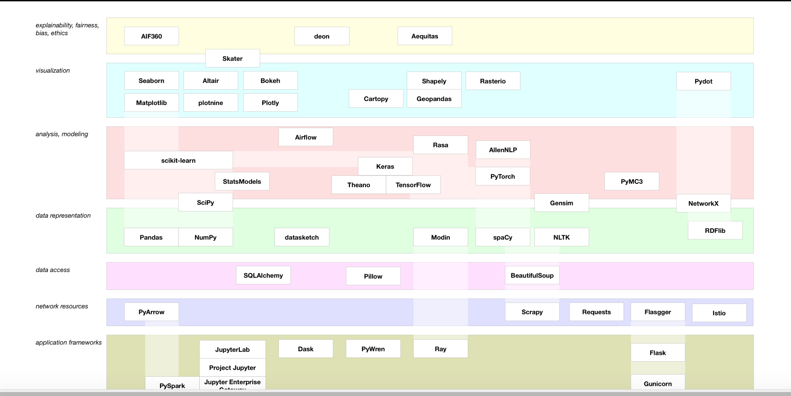

# A landscape diagram for Python data

#### [A landscape diagram for Python data](https://community.ibm.com/community/user/datascience/blogs/paco-nathan/2019/03/12/a-landscape-diagram-for-python-data) 

landscape

####  

