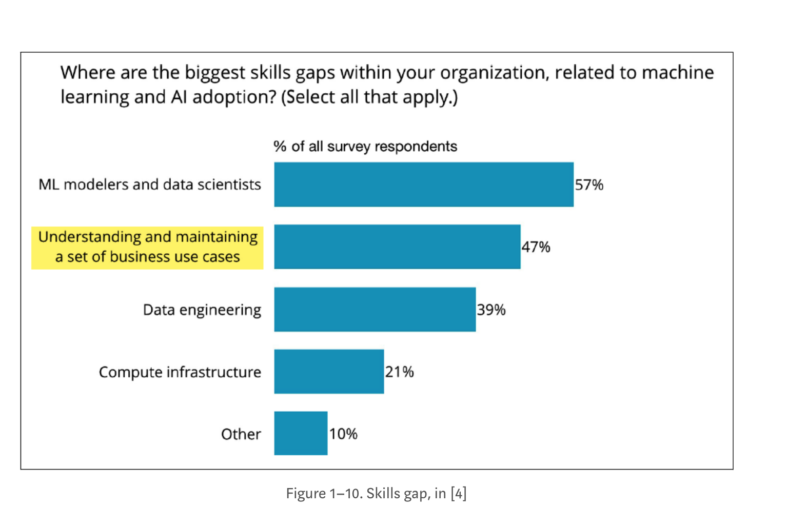

# Confronting Deep Learning Systems: How Much Things Have Changed and How Much We Do Not Know

## [Confronting Deep Learning Systems: How Much Things Have Changed and How Much We Do Not Know](https://towardsdatascience.com/confronting-deep-learning-systems-how-much-things-have-changed-f067738b728f) 



#### Thinking New Paradigms and New Values 

One useful way to comprehend the above take-away points is to realize that **WE ALL** need to think differently about the basic paradigms and values that have driven the technological advances of enterprise systems over past decades. This is not easy! Because…

It is a new way of thinking about **information** and how to utilize information effectively to improve business processes. Only generating insights for managers is no longer sufficient, which threats most of current Business Intelligence infrastructure today. Insights must not languish in committee meetings but must be immediately transformed into guidance for conducting today’s business transactions.

It is a new way of thinking about **software**, which today is essentially art works of talented computer programmers …like paintings in a museum that portray cleaver pieces of static logic. The world is not static. Every piece of static logic is obsolete the day it goes into production, requiring constant hacking and patching to track the every-changing world. Software today fails to track these hourly zigzags of the world.

It is a new way of thinking about **learning**, which today is confined to data integration of an organization’s information ecosystem, as reflected in data warehouse + data lake architectures. This paradigm must shift to managing models that generalized this data into a constant learning process. Software must track each zigzag of the world by constantly evolving the logic within those models. So, that AI system that you installed last week is now quite different in behavior this week. Can you manage that?

It is a new way of thinking about **human intelligence** and its role in managing the organization. It is becoming easier to think that **replacing**human intelligence with artificial intelligence is more cost efficient, hence it naturally leads to job elimination. One should accept this outcome and discover a new vocation. It is becoming harder to think that **augmenting**human intelligence with artificial intelligence \(e.g., human-in-the-loop\) has unique benefits that should be engineered into AI systems. This seems like an increasingly difficult task, without obvious benefits to the organization. So, is this the eventual outcome for human intelligence in future society?

Unfortunately, many organizations will never be able to transform their culture, thus losing their competitive advantage — the purpose for being a business — and suffering a lingering demise.

This is not inevitable! As IT professionals, we live in interesting times. Cough! With the exploding availability of AI technologies, we have exciting beneficial opportunities to transform businesses globally in ways that are now unimaginable.

The hope is that, as a society, we do so to benefit all. However, the unfortunate reality is… If we are lazy or self-centered or even malicious, those same opportunities are available for misuse.

##  [3 promising areas for AI skills development](https://www.oreilly.com/ideas/3-promising-areas-for-ai-skills-development)

## [Themes and Conferences per Pacoid, Episode 7](https://blog.dominodatalab.com/themes-and-conferences-per-pacoid-episode-7/)

## Management

As one might expect, our first survey showed how the sophisticated organizations leverage their internal data science teams to build their ML models, while less experienced organizations tend to rely more on external consultants:

However, one surprise was that a large chunk of the more sophisticated organizations rely on data science leads to set project priorities and determine the key metrics for success:

Those are traditionally the responsibilities of product managers or executives. Moreover, the more sophisticated organizations report they use “Other” methodology, instead of “Agile” methodology, substantially more. We didn’t have a way to probe what that “Other” approach might be.

## [_AI adoption advances, but foundational barriers remain_](https://www.mckinsey.com/featured-insights/artificial-intelligence/ai-adoption-advances-but-foundational-barriers-remain)\_\_









## [Three surveys of AI adoption reveal key advice from more mature practices](https://www.oreilly.com/ideas/three-surveys-of-ai-adoption-reveal-key-advice-from-more-mature-practices)

### Advice from the leaders

Admittedly, the survey for _AI Adoption in the Enterprise_ drew from the initiated: 81% of respondents work for organizations that already use AI. We have much to learn from their collective experiences. For example, there’s a story unfolding in the contrast between mature practices and firms that are earlier in their journey toward AI adoption. Some of the key advice emerging from the mature organizations includes:

* Work toward overcoming challenges related to company culture or not being able to recognize the business use cases.
* Be mindful that the lack of data and lack of skilled people will pose ongoing challenges.
* _**While hiring data scientists, complement by also hiring people who can identify business use cases for AI solutions**_.
* Beyond just optimizing for business metrics, also check for model transparency and interpretability, fairness and bias, and that your AI systems are reliable and safe.
* Explore use cases beyond deep learning: other solutions have gained significant traction, including human-in-the-loop, knowledge graphs, and reinforcement learning.
* Look for value in applications of [transfer learning](https://learning.oreilly.com/videos/oreilly-artificial-intelligence/9781491985250/9781491985250-video314919), which is a nuanced technique the more advanced organizations recognize.
* Your organization probably needs to invest more in infrastructure engineering than it thinks, perpetually.

